Nama    : Ayu Putri Dewi Fitriyani
Kelas   : E

# PBP Tugas 7-----------------------
### Perbedaan Stateless Widget dan Stateful Widget 

Stateless Widget : Widget yang gabisa berubah dan gaakan pernah berubah, selain itu bisa dikombinasikan dengan Stateless Widget

-  Berguna apabila bagian dari interface yang user gambarkan gabergantung pada apapun selain informasi  Berguna ketika bagian dari antarmuka pengguna gambarkan tidak bergantungkonfigurasi di obyek itu sendiri dan BuildContext dismana widget tersebut meningkat.

Stateful Widget : Widget yang dinamis atau bisa berubah

Perbedaan :
| Stateless Widget | Stateful Widget| 
| :---------: | ----------: |
| Tidak bisa menggunakan fungsi *setState()* | Bisa menggunakan fungsi *setState()*  | 
| Prosesnya dari *Constructor* -> *Build* | Prosesnya dari *Constructor* -> *Internal State* -> *Build*  |
| Untuk dapat merubah tampilan UI, harus re-render widget, makin banyak makin tinggi performance yang diperlukan di device | gaperlu, kebalikannya |
| Bawaan Flutter : Text, Icon, IconButton, dll  | Checkbox, Radio, Slider, TextField, dll|

Notes :
*Internal State* : tahap dimana ada pemrosesan state / keaadaan baru yang dipicu dari perubahan data

### Widget yang dipakai pada aplikasi

- Text : untuk menampilkan kata-kata yang diinginkan seperti GENAP atau GANJIL
- Row : untuk menampilkan data, dalam kasus ini yaitu berupa pilihan button apakah ingin di increment atau decrement
- Scaffold : untuk memberi tema material yg jadi dasar dari tampilan device nya pas artikel dibuat. 
- Column : biar tata letaknya fleksibel ke arah horizontal maupun vertikal
- Padding : menambahkan jarak antara container dengan widget yang ada di dalamnya
- AppBar : menu petunjuk untuk memudahkan user
- FloatingActionButton : tombol lingkaran yang memicu tindakan utama di UI aplikasi 
- Center : untuk membuat konten yang ada di child berada di tengah
- Icon : untuk menampilkan design berupa icon

### setState()

*setState()* : untuk memberi tahu framework bila ada yang berubah di object pada *State*, lalu akan build ulang pada *widget* tsb. Maka dari itu framework akan memanggil method *build()* untuk *reload* UI

### Perbedaan antara const dengan final.

*final* dan *const* : keyword yang dapat digunakan untuk membuat variabel yang bersifat immutable.

*const* :
- Mengharuskan variabel harus dinialisasi pada saat kompilasi, nilai bersifat konstan dan secara langsung / eksplisit sehingga pas kompilasi variabel - sudah memiliki nilai

*final* :
- final tidak mengharuskan variabel memiliki nilai secara langsung / eskplisit pada saat kompilasi.

### Jelaskan bagaimana cara kamu mengimplementasikan checklist di atas.
1. Sebelum memulai project, memastikan semua set up sudah lengkap dengan command *flutter doctor* pada cmd

2. Membuat project pada Vscode 
- Click View
- Click Command Pallate
- Type Flutter -> click *Flutter : New Project* -> *Application*
- Open file lib -> *main.dart*

3. Membuat Program Counter
- Menambahkan  variabel *_counter* untuk dipakai nantinya
- Membuat method *increment* & *decrement*
- build *widget* yang isinya tampilan device nya ada apa aja
- Buat *condition* apabila angka berupa ganjil ataupun genap
-Lalu Start and Debugging

# PBP Tugas 8 -----------------------

1. Jelaskan perbedaan Navigator.push dan Navigator.pushReplacement.

| Navigator.push () | Navigator.pop ()| 
| :---------: | ----------: |
| Metode push digunakan untuk menambahkan rute lain ke atas tumpukan screen (stack) saat ini. | Metode pop menghapus rute paling atas dari tumpukan. | 
| Halaman baru ditampilkan di atas halaman sebelumnya.| Ini menampilkan halaman sebelumnya kepada pengguna. |

2. Sebutkan widget apa saja yang kamu pakai di proyek kali ini dan jelaskan fungsinya.
    ##### Column: untuk menampung widget lainnya secara vertikal
    ##### Container: sebagai container untuk menampung widget lainnya
    ##### Form: untuk membuat form
    ##### ListTile: row yang menampung teks sebagai leading dan trailing
    ##### Drawer: untuk membuat drawer di sisi kiri layar (untuk navigasi)

3. Sebutkan jenis-jenis event yang ada pada Flutter (contoh: onPressed).
    ##### onChanged : terjadi ketika widget diubah
    ##### onPressed : terjadi ketik awidget di tekan
    ##### onTap: terjadi ketika widget di tap
    ##### onSaved: terjadi ketika widget disimpan

4. Jelaskan bagaimana cara kerja Navigator dalam "mengganti" halaman dari aplikasi Flutter.

    Navigator akan mengganti halaman aplikasi dan mengatur stack of route. Selain itu Navigator akan menyediakan dua cara untuk mengatur stack of route :
    - Declarative => menggunakan Navigator.pages
    - Imperative => menggunakan Navigator.push dan Navigator.pop

5. Jelaskan bagaimana cara kamu mengimplementasikan checklist di atas.

##### Membuat tiga tombol navigasi pada drawer 
    - Membuat file berupa drawer.bat yang berisi 3 navigasi, sebenernya bisa aja ditaro di file tambah_budget (seperti di form.dart lab 7) tapi agar memudahkan saja
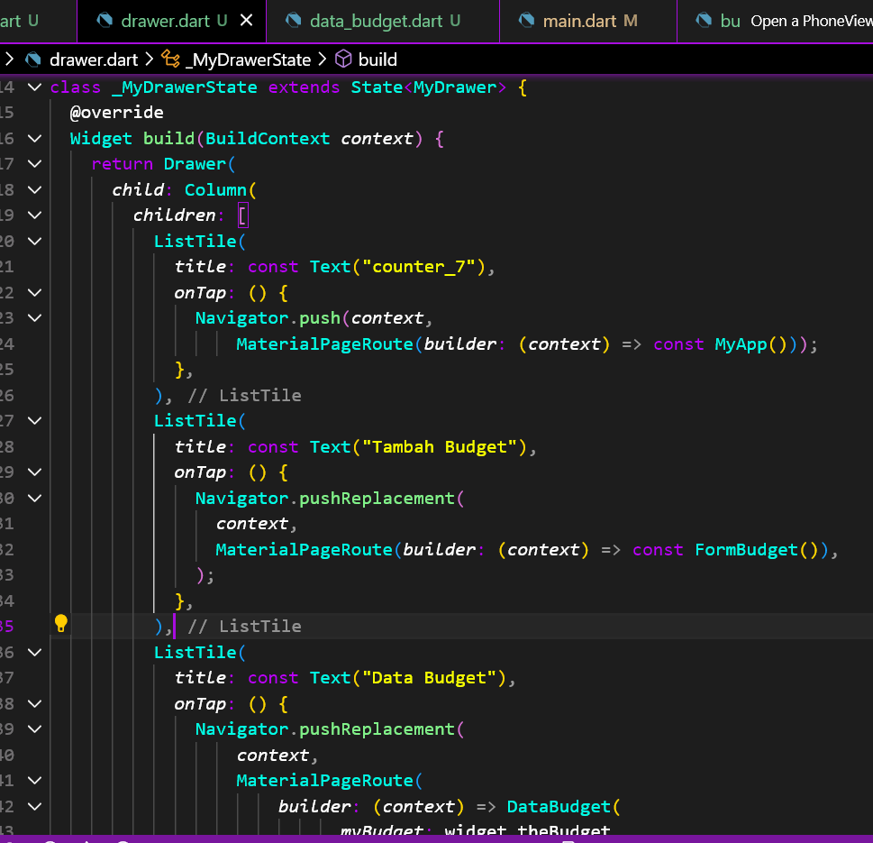

##### Membuat form judul dan nominal 
    - membuat variable terlebih dahulu
    - memasukan fungsi drawer pada buildcontext
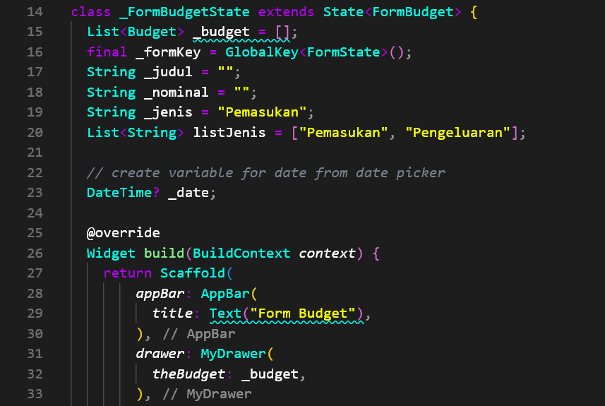

##### Membuat padding yang mengatur form judul dan nominal tersebut
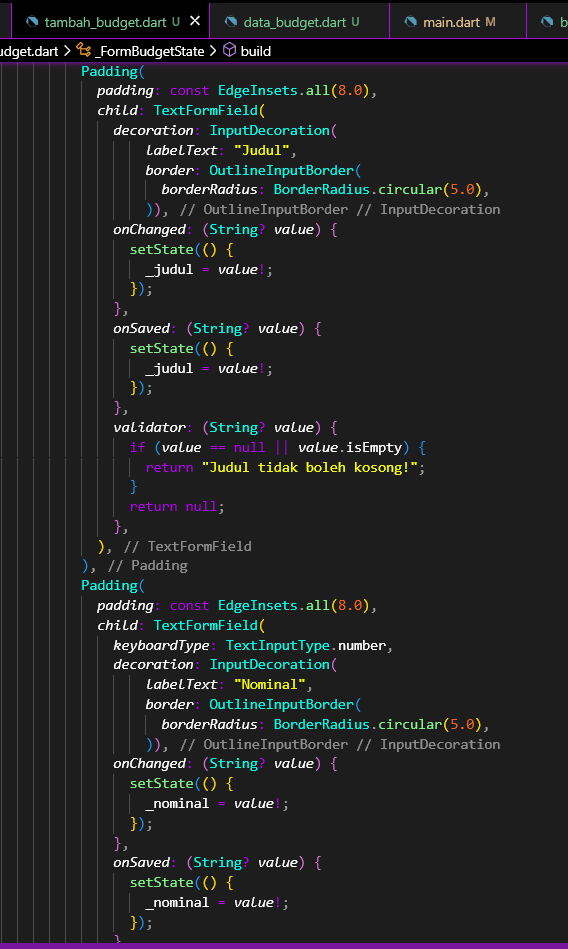

##### Membuat dropdown
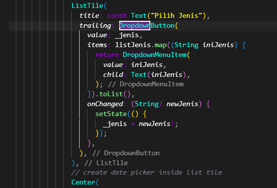

##### Membuat button yang memunculkan tanggal
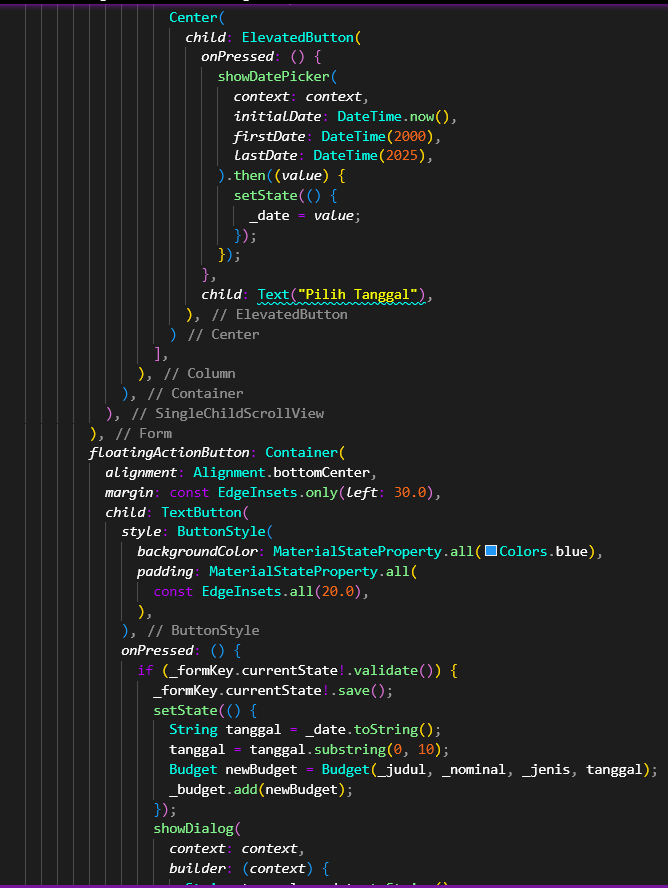
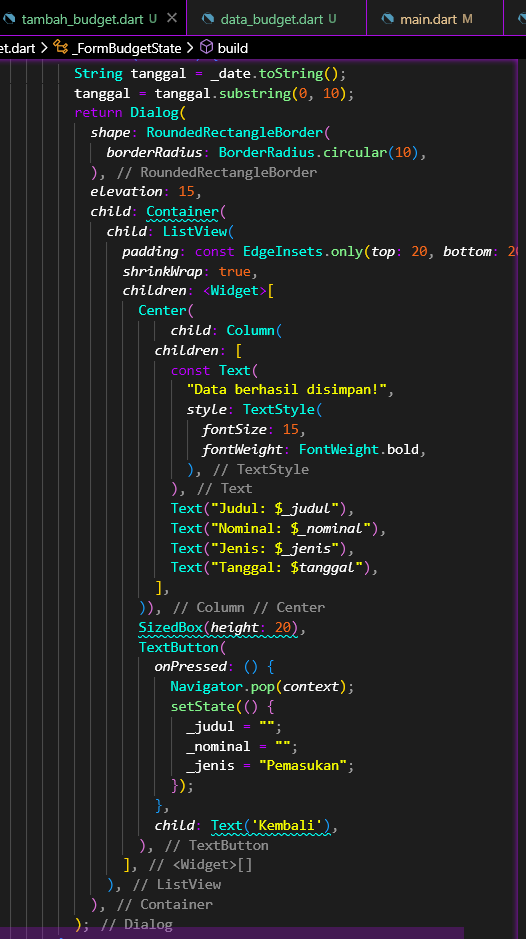

##### Membuat file data_budget yang akan menampilkan semua data yang diinput
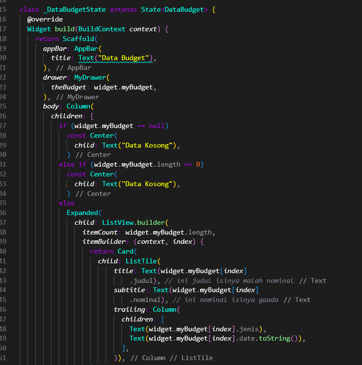

##### Membuat file budget yang akan menampilkan attribute yang dibutuhkan
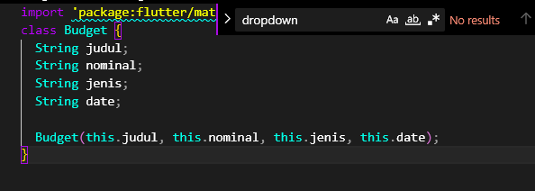

# PBP Tugas 9 -----------------------
 
 ### 1. Apakah bisa kita melakukan pengambilan data JSON tanpa membuat model terlebih dahulu? Jika iya, apakah hal tersebut lebih baik daripada membuat model sebelum melakukan pengambilan data JSON?

=> Pengambilan data JSON dapat dilakukan tanpa membuat model terlebih dahulu. 
Secara behavioral, JSON = suatu object dalam notasi Javascript. Dalam bahasa Dart, hal itu ekuivalen dengan Map di mana object yang terdiri dari key dengan value pair.

Pengambilan data JSON tanpa melakukan konversi ke dalam suatu model => bukan merupakan best practice dalam pengimplementasiannya

Konversi data JSON ke dalam suatu model => untuk meminimalisir kesalahan pengambilan atau pengiriman data melalui http-request yang akan ditampilkan pada sisi UI aplikasi.

 ### 2. Sebutkan widget apa saja yang kamu pakai di proyek kali ini dan jelaskan fungsinya.

| Widget | Fungsi | 
| :---------: | ----------: |
| Scaffold | Widget utk mengatur struktur visual layout dengan mengimplementasikan material design | 
| Form | utk buat form  | 
| TextStyle | memberikan styling pada text, misalnya warna | 
| Padding | memberikan jarak pada widget | 
| Column | utk menampung widget lainnya secara vertikal | 
| Container | sebagai container utk menampung widget lainnya | 
| ListTile | row yg menampung teks sbg leading dan trailing | 
| Drawer | utk buat drawer di sisi kiri layar (utk navigasi)  | 
| FutureBuilder | utk generate array of widget brdsrkn suatu snapshot dgn memperhatikan interaksi snapshot terbaru | 

 ### 3. Jelaskan mekanisme pengambilan data dari json hingga dapat ditampilkan pada Flutter.

1. Membuat sebuah function http request dgn method `GET` => secara async utk ambil data ke pihak eksternal 
2. di function tsb lakukan parsing dgn `jsonDecode()` utk -> ubah response String jd JSON
3. Konversi object JSON ke dlm suatu Model Object
4. Gunakan widget `FutureBuilder` utk menampilkan widget2 dgn snapshot dat aterbaru yg telah dikonversi jd sebuah object

 Mekanisme pengambilan data yang pertama yaitu menambahkan import dart convert pada bagian paling atas file. Ketika kita me-request suatu web service dengan method GET, umumnya kita mendapatkan hasil pemanggilan berupa JSON. Maka perlu konversi data dgn method fromJson => Flutter mengenali JSON tersebut sebagai objek class MyWatchList. Method toJson => akan digunakan pas kita melakukan pengiriman data ke web service (seperti POST atau PUT). 

 
 ### 4. Jelaskan bagaimana cara kamu mengimplementasikan checklist di atas.

##### Menambahkan drawer pada navigation bar di drawer.dart berupa MyWatchList, yg nantinya akan menampilkan mywatchlist_page.dart
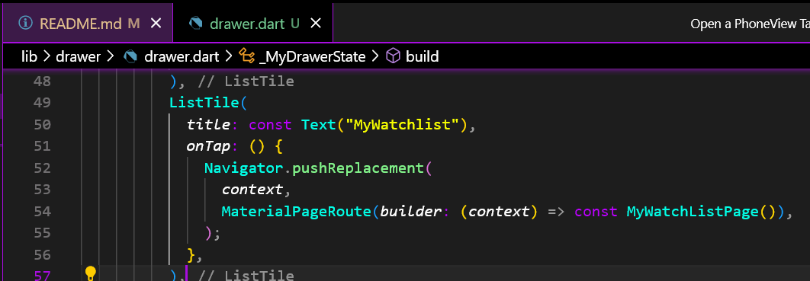

##### Membuat model untuk mywatchlist, di foler model => mywatchlist.dart

#### 1. Membuat Respons dari web service berupa kumpulan objek JSON
      - ketika kita me-request suatu web service dengan method GET, umumnya kita mendapatkan hasil pemanggilan berupa JSON. 
      - Maka perlu konversi data dgn method fromJson => Flutter mengenali JSON tersebut sebagai objek class MyWatchList
      - Method toJson => akan digunakan pas kita melakukan pengiriman data ke web service (seperti POST atau PUT).

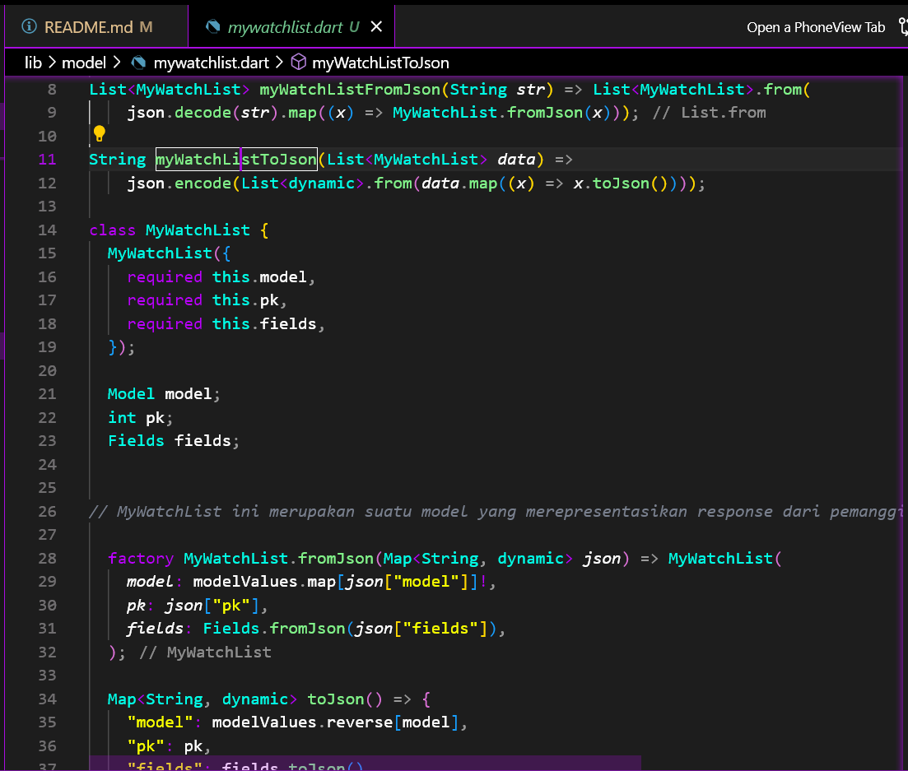
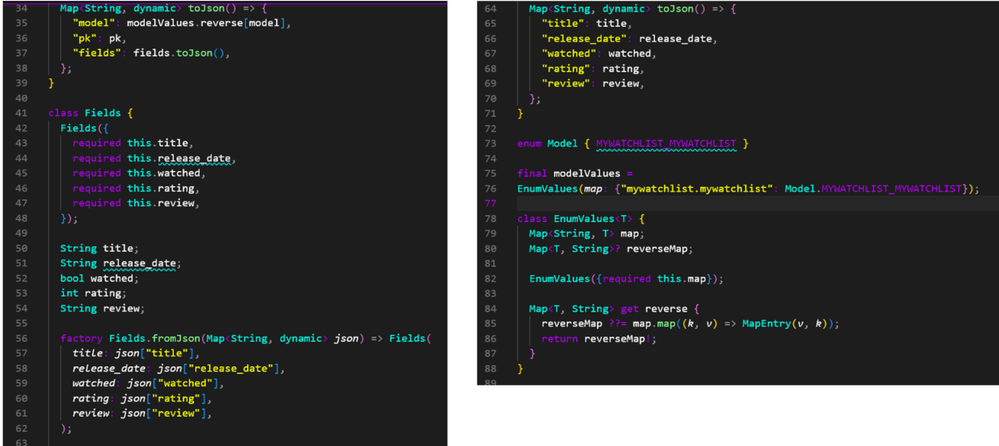

#### 2. Membuat page MyWatchList yang akan berisi data semua watch list yang ada pada endpoint JSON di Django yang telah kamu deploy ke Heroku sebelumnya (Tugas 3).  => mywatchlist_page.dart 

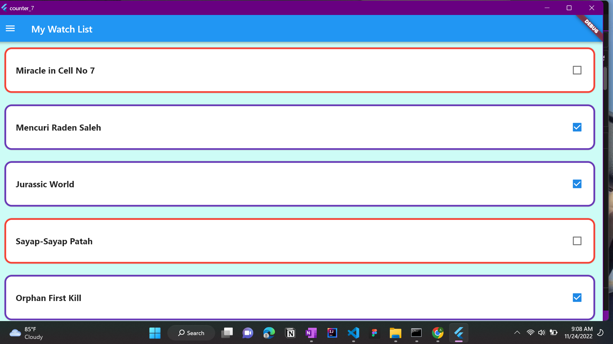
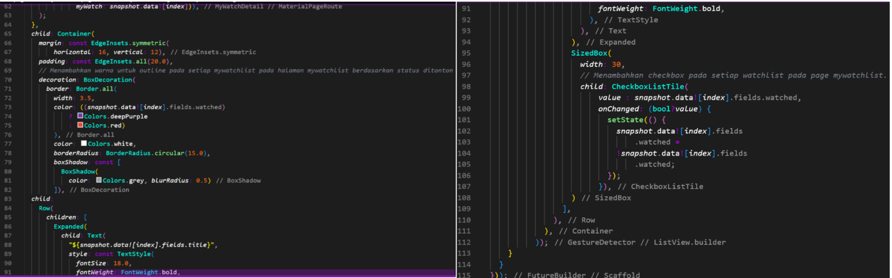

#### 3. Membuat page MyWatchList yang akan berisi data detail dari masing-masing watch list yang tersedia, dan bisa muncul ketika judul watchlist nya di klik => mywatchlist_detail.dart  
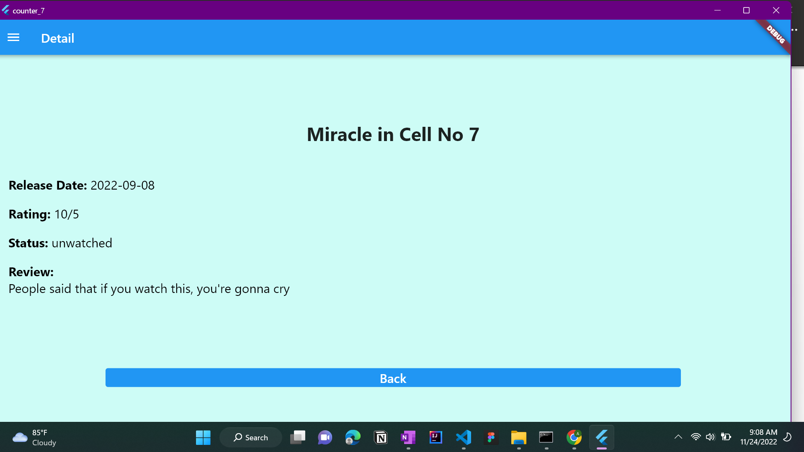
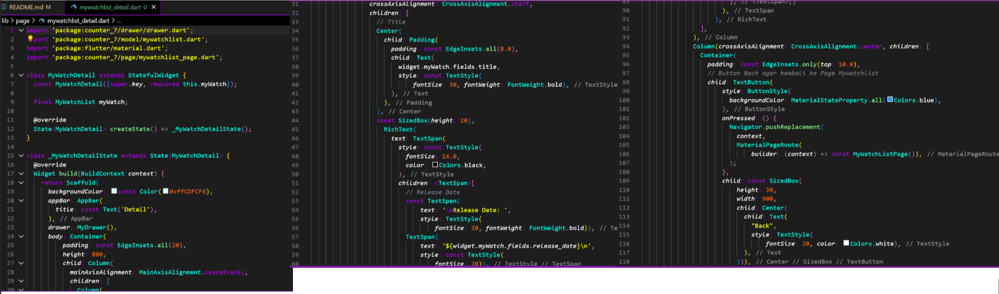

#### 3. Membuat folder dataSource dan membuat file => mywatchlist_remote_dataSource.dart
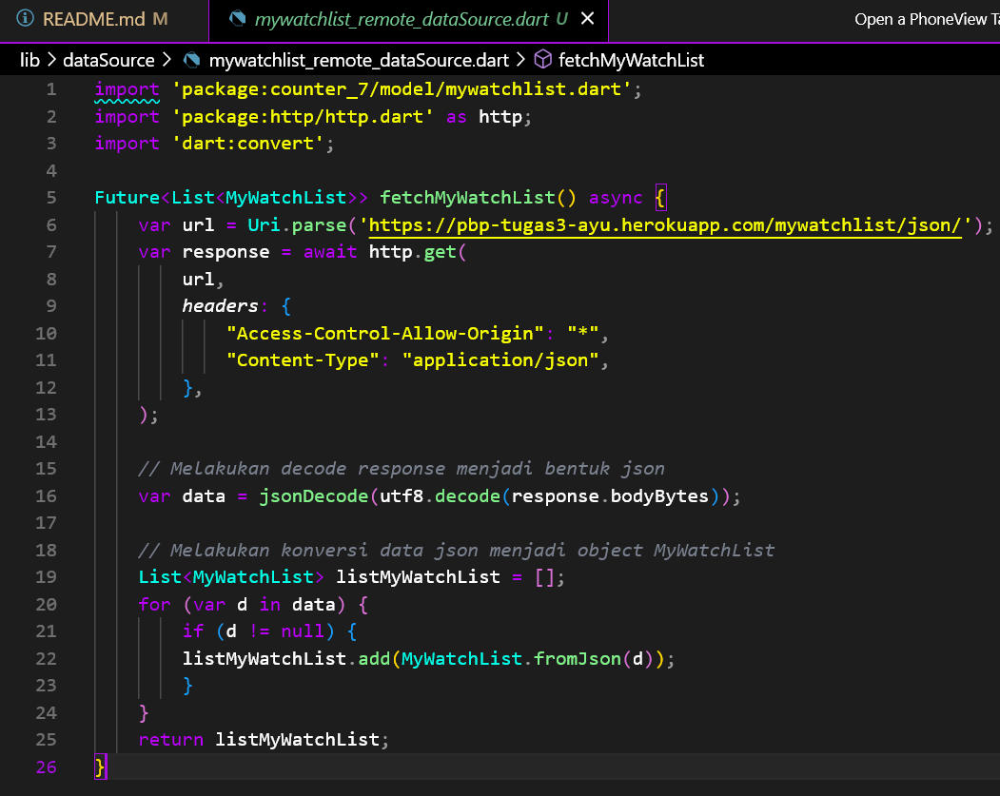

#### 4. Menambahkan Dependensi HTTP
    -melakukan perintah HTTP request, kita membutuhkan package tambahan yakni package http.
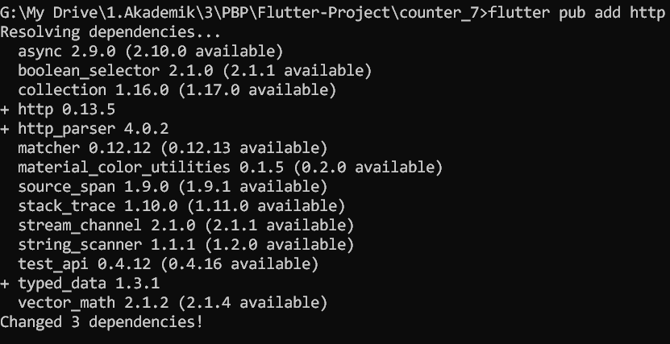
